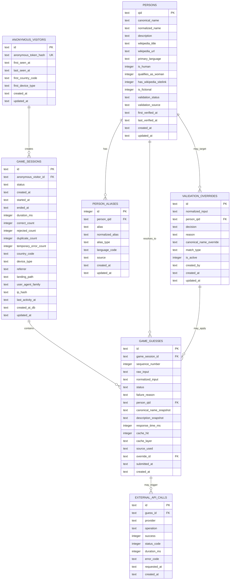

# Name100Women MVP 数据模型与ERD文档

- 项目：Name 100 Women
- 数据库：Cloudflare D1（SQLite）
- ORM：Drizzle ORM
- 缓存：Cloudflare KV
- 文档版本：v1.0

---

## 1. 设计目标

数据模型需要支持：

1. 匿名游戏 Session；
2. 第一位有效人物后开始服务端计时；
3. 每次 Guess 的完整验证记录；
4. Wikidata QID 级去重；
5. 人物和别名的本地沉淀；
6. 人工接受或拒绝覆盖；
7. Wikipedia/Wikidata 请求与缓存分析；
8. 后续判断高频未识别输入；
9. 未来扩展排行榜和统计时无需重构核心表；
10. 避免MVP阶段引入用户账户、支付或复杂内容模型。

---

## 2. ERD



---

## 3. 枚举定义

D1 不强制原生 enum，建议使用文本字段配合应用层 Zod 和数据库 `CHECK` 约束。

### 3.1 `game_sessions.status`

```text
not_started
in_progress
completed
gave_up
abandoned
```

### 3.2 `game_guesses.status`

```text
ACCEPTED
DUPLICATE
NOT_FOUND
NOT_A_PERSON
NOT_A_WOMAN
FICTIONAL
AMBIGUOUS
TEMPORARY_ERROR
INVALID_REQUEST
RATE_LIMITED
SESSION_NOT_FOUND
GAME_FINISHED
```

通常只有进入业务处理的结果才写入 `game_guesses`。明显非法或无 Session 的请求可只写日志，不强制入业务表。

### 3.3 `persons.validation_status`

```text
verified
rejected
uncertain
stale
```

### 3.4 `persons.validation_source`

```text
seed
wikipedia_wikidata
manual_override
import
```

### 3.5 `person_aliases.alias_type`

```text
canonical
alias
stage_name
birth_name
redirect
transliteration
manual
```

### 3.6 `validation_overrides.decision`

```text
ACCEPT
REJECT
AMBIGUOUS
```

### 3.7 `validation_overrides.match_type`

```text
exact_normalized_input
person_qid
```

### 3.8 `external_api_calls.provider`

```text
wikipedia
wikidata
```

---

## 4. 表定义

## 4.1 `anonymous_visitors`

用途：

- 给同一浏览器生成匿名、非公开的长期标识；
- 分析重复游玩；
- 不保存明文 Cookie token；
- 不代表真实用户身份。

| 字段 | 类型 | 约束 | 说明 |
|---|---|---|---|
| `id` | TEXT | PK | 服务端 UUID |
| `anonymous_token_hash` | TEXT | UNIQUE NOT NULL | HttpOnly Cookie 随机 token 的哈希 |
| `first_seen_at` | TEXT | NOT NULL | ISO 时间 |
| `last_seen_at` | TEXT | NOT NULL | ISO 时间 |
| `first_country_code` | TEXT | NULL | Cloudflare 国家代码 |
| `first_device_type` | TEXT | NULL | mobile/desktop/tablet/unknown |
| `created_at` | TEXT | NOT NULL | 创建时间 |
| `updated_at` | TEXT | NOT NULL | 更新时间 |

隐私要求：

- 不存明文匿名 token；
- 不将 IP 作为用户 ID；
- 可在后续数据保留策略中定期清理长期未活动记录。

---

## 4.2 `game_sessions`

用途：

- 一局游戏的权威状态；
- 服务端计时；
- 聚合进度；
- 支持 completed、gave_up 和 abandoned 分析。

| 字段 | 类型 | 约束 | 说明 |
|---|---|---|---|
| `id` | TEXT | PK | Session UUID |
| `anonymous_visitor_id` | TEXT | FK, NULL | 匿名访客 |
| `status` | TEXT | NOT NULL | Session 状态 |
| `created_at` | TEXT | NOT NULL | Session 创建时间 |
| `started_at` | TEXT | NULL | 第一位 ACCEPTED 的时间 |
| `ended_at` | TEXT | NULL | 完成或 Give Up 时间 |
| `duration_ms` | INTEGER | NULL | 服务端最终时长 |
| `correct_count` | INTEGER | NOT NULL DEFAULT 0 | 接受数量 |
| `rejected_count` | INTEGER | NOT NULL DEFAULT 0 | 非接受且非重复的数量 |
| `duplicate_count` | INTEGER | NOT NULL DEFAULT 0 | 重复次数 |
| `temporary_error_count` | INTEGER | NOT NULL DEFAULT 0 | 临时异常次数 |
| `country_code` | TEXT | NULL | Cloudflare 国家代码 |
| `device_type` | TEXT | NULL | 设备分类 |
| `referrer` | TEXT | NULL | 来源 |
| `landing_path` | TEXT | NOT NULL DEFAULT '/' | 入口路径 |
| `user_agent_family` | TEXT | NULL | 粗粒度浏览器族 |
| `ip_hash` | TEXT | NULL | 限流与异常分析用短期/轮换哈希 |
| `last_activity_at` | TEXT | NOT NULL | 最后活动时间 |
| `created_at_db` | TEXT | NOT NULL | 数据库写入时间，可与业务 created_at 合并 |
| `updated_at` | TEXT | NOT NULL | 更新时间 |

约束建议：

```sql
CHECK (correct_count >= 0 AND correct_count <= 100)
CHECK (rejected_count >= 0)
CHECK (duplicate_count >= 0)
CHECK (temporary_error_count >= 0)
CHECK (
  status IN ('not_started', 'in_progress', 'completed', 'gave_up', 'abandoned')
)
```

状态转换：

```text
not_started
  → in_progress
  → completed

not_started
  → gave_up

in_progress
  → gave_up

not_started / in_progress
  → abandoned
```

`completed` 和 `gave_up` 为终态。

---

## 4.3 `persons`

用途：

- 本地人物主数据；
- 以 Wikidata QID 作为唯一标识；
- 保存结构化验证结果；
- 支持长期缓存和后续统计。

| 字段 | 类型 | 约束 | 说明 |
|---|---|---|---|
| `qid` | TEXT | PK | 例如 Q7186 |
| `canonical_name` | TEXT | NOT NULL | 标准显示名 |
| `normalized_name` | TEXT | NOT NULL | 标准化检索名 |
| `description` | TEXT | NULL | 简短描述 |
| `wikipedia_title` | TEXT | NULL | 优先英文标题 |
| `wikipedia_url` | TEXT | NULL | 公开页面 |
| `primary_language` | TEXT | NULL | 优先展示语言 |
| `is_human` | INTEGER | NOT NULL | 0/1 |
| `qualifies_as_woman` | INTEGER | NOT NULL | 0/1 |
| `has_wikipedia_sitelink` | INTEGER | NOT NULL | 0/1 |
| `is_fictional` | INTEGER | NOT NULL | 0/1 |
| `validation_status` | TEXT | NOT NULL | verified/rejected/uncertain/stale |
| `validation_source` | TEXT | NOT NULL | seed/API/manual/import |
| `first_verified_at` | TEXT | NULL | 首次验证时间 |
| `last_verified_at` | TEXT | NULL | 最近验证时间 |
| `created_at` | TEXT | NOT NULL | 创建时间 |
| `updated_at` | TEXT | NOT NULL | 更新时间 |

说明：

- `qid` 是人物去重的唯一业务键；
- Boolean 使用 SQLite INTEGER 0/1；
- 人物可被标记为 `stale`，等待后台或人工重新验证；
- MVP 不保存头像，避免不必要复杂度。

---

## 4.4 `person_aliases`

用途：

- 支持艺名、本名、重定向和常见别名；
- `normalized_alias → person_qid` 是高频查询路径。

| 字段 | 类型 | 约束 | 说明 |
|---|---|---|---|
| `id` | INTEGER | PK AUTOINCREMENT | 内部 ID |
| `person_qid` | TEXT | FK NOT NULL | 对应人物 |
| `alias` | TEXT | NOT NULL | 原始别名 |
| `normalized_alias` | TEXT | NOT NULL | 标准化别名 |
| `alias_type` | TEXT | NOT NULL | 类型 |
| `language_code` | TEXT | NULL | 例如 en |
| `source` | TEXT | NOT NULL | seed/wikipedia/wikidata/manual |
| `created_at` | TEXT | NOT NULL | 创建时间 |
| `updated_at` | TEXT | NOT NULL | 更新时间 |

唯一约束建议：

```sql
UNIQUE (person_qid, normalized_alias)
```

注意：

不同人物可能存在相同标准化别名，因此不应直接对 `normalized_alias` 建全局唯一约束。查询到多个 QID 时，应返回 `AMBIGUOUS`，除非有精确人工覆盖。

---

## 4.5 `game_guesses`

用途：

- 保存每次输入和最终判定；
- 支持游戏列表、数据分析和验证优化；
- 保存人物显示快照，避免人物资料更新影响历史记录。

| 字段 | 类型 | 约束 | 说明 |
|---|---|---|---|
| `id` | TEXT | PK | Guess UUID |
| `game_session_id` | TEXT | FK NOT NULL | 所属游戏 |
| `sequence_number` | INTEGER | NOT NULL | 本局提交顺序 |
| `raw_input` | TEXT | NOT NULL | 用户原始输入 |
| `normalized_input` | TEXT | NOT NULL | 标准化输入 |
| `status` | TEXT | NOT NULL | 判定状态 |
| `failure_reason` | TEXT | NULL | 机器可读原因 |
| `person_qid` | TEXT | FK NULL | 匹配人物 |
| `canonical_name_snapshot` | TEXT | NULL | 当时显示名 |
| `description_snapshot` | TEXT | NULL | 当时描述 |
| `response_time_ms` | INTEGER | NOT NULL | 服务端总耗时 |
| `cache_hit` | INTEGER | NOT NULL DEFAULT 0 | 是否缓存命中 |
| `cache_layer` | TEXT | NULL | override/kv/d1/none |
| `source_used` | TEXT | NULL | seed/cache/wikipedia_wikidata/manual |
| `override_id` | TEXT | FK NULL | 使用的人工覆盖 |
| `submitted_at` | TEXT | NOT NULL | 用户提交时间 |
| `created_at` | TEXT | NOT NULL | 写入时间 |

约束建议：

```sql
UNIQUE (game_session_id, sequence_number)
CHECK (sequence_number > 0)
CHECK (response_time_ms >= 0)
CHECK (cache_hit IN (0, 1))
```

不要建立：

```sql
UNIQUE (game_session_id, person_qid)
```

原因：

重复提交也需要保存为 `DUPLICATE`。  
有效人物唯一性应通过“已存在 `ACCEPTED` 的相同 QID”查询或单独部分索引逻辑实现。

SQLite 可使用部分唯一索引：

```sql
CREATE UNIQUE INDEX uq_session_accepted_qid
ON game_guesses(game_session_id, person_qid)
WHERE status = 'ACCEPTED' AND person_qid IS NOT NULL;
```

---

## 4.6 `validation_overrides`

用途：

- 修正第三方数据缺失或错误；
- 明确接受、拒绝或要求消歧；
- MVP 不建设后台，先通过 migration/SQL/脚本维护。

| 字段 | 类型 | 约束 | 说明 |
|---|---|---|---|
| `id` | TEXT | PK | UUID |
| `normalized_input` | TEXT | NULL | 精确输入覆盖 |
| `person_qid` | TEXT | FK NULL | QID 级覆盖 |
| `decision` | TEXT | NOT NULL | ACCEPT/REJECT/AMBIGUOUS |
| `reason` | TEXT | NOT NULL | 维护说明 |
| `canonical_name_override` | TEXT | NULL | 可覆盖显示名 |
| `match_type` | TEXT | NOT NULL | exact_normalized_input/person_qid |
| `is_active` | INTEGER | NOT NULL DEFAULT 1 | 是否启用 |
| `created_by` | TEXT | NULL | admin/script/import |
| `created_at` | TEXT | NOT NULL | 创建时间 |
| `updated_at` | TEXT | NOT NULL | 更新时间 |

约束建议：

```sql
CHECK (decision IN ('ACCEPT', 'REJECT', 'AMBIGUOUS'))
CHECK (match_type IN ('exact_normalized_input', 'person_qid'))
CHECK (is_active IN (0, 1))
CHECK (
  (match_type = 'exact_normalized_input' AND normalized_input IS NOT NULL)
  OR
  (match_type = 'person_qid' AND person_qid IS NOT NULL)
)
```

优先级：

```text
精确输入人工覆盖
→ QID 人工覆盖
→ KV
→ D1 人物/别名
→ 实时外部验证
```

---

## 4.7 `external_api_calls`

用途：

- 观察第三方 API 的稳定性和耗时；
- 关联某次 Guess；
- 不保存完整第三方响应，避免数据膨胀。

| 字段 | 类型 | 约束 | 说明 |
|---|---|---|---|
| `id` | TEXT | PK | UUID |
| `guess_id` | TEXT | FK NOT NULL | 关联 Guess |
| `provider` | TEXT | NOT NULL | wikipedia/wikidata |
| `operation` | TEXT | NOT NULL | exact/search/entity/details 等 |
| `success` | INTEGER | NOT NULL | 0/1 |
| `status_code` | INTEGER | NULL | HTTP 状态 |
| `duration_ms` | INTEGER | NOT NULL | 调用耗时 |
| `error_code` | TEXT | NULL | timeout/schema_error 等 |
| `requested_at` | TEXT | NOT NULL | 请求时间 |
| `created_at` | TEXT | NOT NULL | 写入时间 |

如果早期担心写入量，可通过采样保存成功调用，但错误调用建议全量保存。

---

## 5. 推荐索引

```sql
CREATE UNIQUE INDEX idx_anonymous_token_hash
ON anonymous_visitors(anonymous_token_hash);

CREATE INDEX idx_sessions_visitor_created
ON game_sessions(anonymous_visitor_id, created_at DESC);

CREATE INDEX idx_sessions_status_last_activity
ON game_sessions(status, last_activity_at);

CREATE INDEX idx_sessions_created
ON game_sessions(created_at DESC);

CREATE INDEX idx_persons_normalized_name
ON persons(normalized_name);

CREATE INDEX idx_persons_validation_status
ON persons(validation_status, last_verified_at);

CREATE INDEX idx_alias_normalized
ON person_aliases(normalized_alias);

CREATE INDEX idx_alias_person
ON person_aliases(person_qid);

CREATE INDEX idx_guesses_session_sequence
ON game_guesses(game_session_id, sequence_number);

CREATE INDEX idx_guesses_normalized_status
ON game_guesses(normalized_input, status);

CREATE INDEX idx_guesses_person_status
ON game_guesses(person_qid, status);

CREATE INDEX idx_guesses_submitted
ON game_guesses(submitted_at DESC);

CREATE UNIQUE INDEX uq_session_accepted_qid
ON game_guesses(game_session_id, person_qid)
WHERE status = 'ACCEPTED' AND person_qid IS NOT NULL;

CREATE INDEX idx_overrides_input_active
ON validation_overrides(normalized_input, is_active);

CREATE INDEX idx_overrides_qid_active
ON validation_overrides(person_qid, is_active);

CREATE INDEX idx_external_guess_provider
ON external_api_calls(guess_id, provider);

CREATE INDEX idx_external_provider_requested
ON external_api_calls(provider, requested_at DESC);
```

---

## 6. KV键设计

KV 用于加速，不作为唯一事实来源。

### 6.1 Alias 缓存

```text
alias:{normalization_version}:{normalized_input}
```

值示例：

```json
{
  "type": "resolved",
  "qid": "Q7186",
  "cachedAt": "ISO timestamp"
}
```

模糊示例：

```json
{
  "type": "ambiguous",
  "qids": ["Q1", "Q2"],
  "cachedAt": "ISO timestamp"
}
```

### 6.2 Person 缓存

```text
person:{qid}
```

值示例：

```json
{
  "qid": "Q7186",
  "canonicalName": "Marie Curie",
  "description": "Polish and French physicist and chemist",
  "isHuman": true,
  "qualifiesAsWoman": true,
  "hasWikipediaSitelink": true,
  "isFictional": false,
  "validationStatus": "verified",
  "lastVerifiedAt": "ISO timestamp"
}
```

### 6.3 负缓存

```text
negative:{normalization_version}:{normalized_input}
```

值：

```json
{
  "status": "NOT_FOUND",
  "cachedAt": "ISO timestamp"
}
```

TTL：6–24小时。

### 6.4 限流键

```text
rate:guess:{ip_hash}:{window}
rate:session:{session_id}:{window}
```

KV 一致性不适合严格并发锁。若后续需要更强一致限流，可引入 Cloudflare Rate Limiting 或 Durable Objects；MVP先采用轻量策略。

---

## 7. 关键查询

### 7.1 查询人工覆盖

```sql
SELECT *
FROM validation_overrides
WHERE is_active = 1
  AND match_type = 'exact_normalized_input'
  AND normalized_input = ?
LIMIT 1;
```

### 7.2 通过别名查询人物候选

```sql
SELECT
  p.*,
  a.alias_type
FROM person_aliases a
JOIN persons p ON p.qid = a.person_qid
WHERE a.normalized_alias = ?;
```

返回：

- 0 条：进入外部验证；
- 1 个唯一 QID：继续检查人物状态；
- 多个 QID：返回 `AMBIGUOUS`，除非人工覆盖。

### 7.3 检查本局重复

```sql
SELECT 1
FROM game_guesses
WHERE game_session_id = ?
  AND person_qid = ?
  AND status = 'ACCEPTED'
LIMIT 1;
```

### 7.4 获取高频未识别输入

```sql
SELECT
  normalized_input,
  status,
  COUNT(*) AS occurrences,
  COUNT(DISTINCT game_session_id) AS sessions,
  MAX(submitted_at) AS last_seen_at
FROM game_guesses
WHERE status IN ('NOT_FOUND', 'AMBIGUOUS', 'TEMPORARY_ERROR')
GROUP BY normalized_input, status
ORDER BY sessions DESC, occurrences DESC
LIMIT 100;
```

### 7.5 进度漏斗

```sql
SELECT
  SUM(CASE WHEN correct_count >= 1 THEN 1 ELSE 0 END) AS reached_1,
  SUM(CASE WHEN correct_count >= 10 THEN 1 ELSE 0 END) AS reached_10,
  SUM(CASE WHEN correct_count >= 25 THEN 1 ELSE 0 END) AS reached_25,
  SUM(CASE WHEN correct_count >= 50 THEN 1 ELSE 0 END) AS reached_50,
  SUM(CASE WHEN correct_count >= 75 THEN 1 ELSE 0 END) AS reached_75,
  SUM(CASE WHEN correct_count = 100 THEN 1 ELSE 0 END) AS completed
FROM game_sessions;
```

---

## 8. 事务与一致性

处理 `ACCEPTED` Guess 时，应在一个 D1 batch/事务逻辑中完成：

1. 确认 Session 非终态；
2. 检查相同 QID 是否已有 `ACCEPTED`；
3. 插入 Guess；
4. 如果是第一位有效人物，写入 `started_at` 并设置 `in_progress`；
5. `correct_count + 1`；
6. 如果达到 100，设置 `completed`、`ended_at` 和 `duration_ms`；
7. 更新 `last_activity_at`。

需要依靠部分唯一索引防止并发请求导致同一 QID 被重复接受。

---

## 9. Abandoned判定

由于用户可能直接关闭网页，`abandoned` 不能完全依靠前端事件。

建议使用规则：

```text
status IN ('not_started', 'in_progress')
AND last_activity_at < now - abandonment_threshold
```

MVP 可在分析查询时动态计算，或通过 Cloudflare Cron 每日批量更新。

推荐阈值：30分钟或更长。具体值可在数据出现后调整。

---

## 10. 数据保留建议

MVP 初期可先完整保存，待流量验证后再实施清理任务。

建议后续策略：

- `game_sessions`：保留聚合分析所需周期；
- `game_guesses.raw_input`：属于产品验证关键数据，但需在隐私政策中说明；
- `ip_hash`：使用轮换盐，设置较短保留周期；
- `external_api_calls`：成功调用可按周期清理或聚合；
- 人物和别名：长期保存；
- 人工覆盖：长期保存并保留变更记录。

---

## 11. Drizzle实现建议

### 11.1 文件拆分

```text
app/server/db/
├── schema/
│   ├── anonymous-visitors.ts
│   ├── game-sessions.ts
│   ├── persons.ts
│   ├── person-aliases.ts
│   ├── game-guesses.ts
│   ├── validation-overrides.ts
│   ├── external-api-calls.ts
│   └── index.ts
├── client.ts
└── migrations/
```

### 11.2 Repository

```text
PersonRepository
AliasRepository
GameSessionRepository
GuessRepository
OverrideRepository
ExternalApiCallRepository
```

Route 中不得直接散落 SQL。

---

## 12. 未来扩展兼容性

### 排行榜

后续可新增：

```text
leaderboard_entries
```

关联 `game_session_id`，仅接受 completed Session。

### 公开统计

可从现有 `game_sessions`、`game_guesses`、`persons` 聚合，无需修改核心关系。

### 用户系统

后续可新增 `users`，并让 `game_sessions.user_id` 可空，不影响匿名模式。

### 多游戏模式

后续为 `game_sessions` 增加 `game_mode` 字段，或新增 `game_modes` 表。MVP固定 Classic Mode，不提前建设。

---

## 13. 数据模型验收

- Migration 可在空 D1 创建全部表；
- Seed 可导入 500–1,000 位人物及别名；
- 同一 QID 可拥有多个别名；
- 同一标准化别名可对应多个 QID；
- 同一 Session 中同一 QID 只能有一个 `ACCEPTED`；
- `DUPLICATE` Guess 仍可写入；
- 第一位 `ACCEPTED` 自动写 `started_at`；
- 第100位 `ACCEPTED` 自动完成；
- 人工覆盖优先于缓存和外部验证；
- 可查询高频未识别输入；
- 可计算游戏漏斗和平均验证耗时；
- KV 删除后应用可从 D1 或外部服务恢复。
